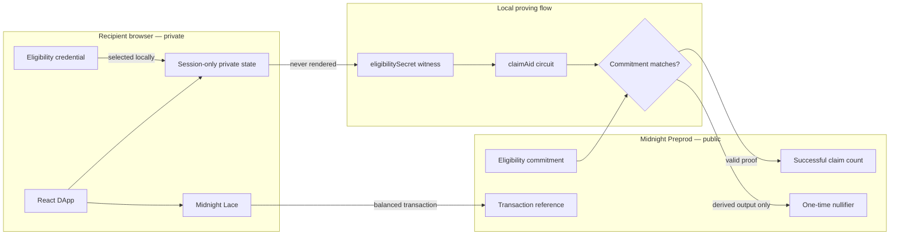

# VeilAid

> Prove you qualify. Claim once. Keep your story private.

VeilAid is a privacy-first aid claim DApp on Midnight Network. A recipient uses
a private eligibility credential to prove that they qualify without publishing
their identity or eligibility secret. Organizers receive a public, auditable
claim count and the contract rejects a second use of the same eligibility.

## Live Demo

**Deployment pending:** the production URL will be added here after the Preprod
contract is connected and the Vercel deployment is verified with Lace.

## Contract Address

| Network | Contract address | Status |
|---|---|---|
| Preprod | `PENDING_PREPROD_DEPLOYMENT` | Deployment in progress |
| Preview | `f19931af3c381275ef72c4e6a28e50613b6f55139387d280744b38753376579d` | Level 1 deployment, verified |

The Level 2 frontend targets **Preprod**. Set `VITE_CONTRACT_ADDRESS` to the
Preprod address before running or deploying the browser app.

## What This Does

Aid programs often require recipients to reveal names, identity documents,
health conditions, or financial hardship to several intermediaries. VeilAid
creates a smaller disclosure boundary:

1. Connect Midnight Lace on Preprod.
2. Select the private eligibility credential issued for the campaign.
3. Generate the zero-knowledge proof through Lace's local proving flow.
4. Submit the proof to the deployed `claimAid` circuit.
5. Receive a transaction receipt while the public claim count increments.
6. Reject any attempt to use that campaign eligibility again.

The interface shows each stage—preparing input, proving, submitting, and
confirming—without rendering the private secret.

## Privacy Model

- **What is PUBLIC:** the eligibility commitment, successful claim count,
  one-time claim flag, derived nullifier, contract address, and transaction
  reference.
- **What is PRIVATE:** the recipient's 32-byte eligibility secret and any
  real-world facts represented by it. The browser reads the credential into
  session memory only.
- **What the user PROVES without revealing:** the private secret hashes to the
  public commitment accepted by this campaign.

The browser does not put credential data in the DOM, URL, console, analytics,
or transaction output. Closing or refreshing the page clears its in-memory
copy. The credential file created during deployment is stored in the
gitignored `.veil-aid-private/` directory with owner-only permissions.

## Privacy Claim

An on-chain observer sees that a valid campaign eligibility produced one claim,
plus the claim counter, a domain-separated nullifier, and the transaction
reference. The observer cannot see the recipient's identity, eligibility
secret, credential file, or the real-world reason the recipient qualifies.

**Eligibility proved without revealing your identity or eligibility secret.**

## Architecture



## Tech Stack

- Midnight Preprod network and Compact 0.23
- Midnight.js 4.1.1
- DApp Connector API 4.0.1
- Midnight Lace wallet with wallet-backed proving
- React 19, Vite 8, and TypeScript
- Node.js 22 or newer
- Docker and proof server 8.1.0 for CLI deployment

## Prerequisites

- Node.js 22 or newer
- Midnight Lace browser extension, installed and unlocked
- Lace configured for the Midnight Preprod network
- A faucet-funded Preprod Lace wallet with enough NIGHT/DUST for fees
- Docker with Compose v2 for contract deployment
- Compact devtools with compiler 0.31.1

## Run Locally

```bash
git clone git@Yilkash:Yilkash/veil-aid.git
cd veil-aid
npm install
npm dedupe
npm run compile
```

Create `.env.local` without committing it:

```bash
VITE_NETWORK_ID=preprod
VITE_CONTRACT_ADDRESS=PASTE_PREPROD_CONTRACT_ADDRESS
```

Start the app:

```bash
npm run dev
```

Open `http://localhost:5173`, connect Lace, select the private credential in
`.veil-aid-private/eligibility-preprod.json`, and call **Prove & claim aid**.
The credential must match the configured network and contract.

## Run Tests

```bash
npm test
npm run build
```

`npm test` compiles the Compact source and runs seven tests covering private
witness handling, domain-separated hashes, commitment changes, credential
validation, campaign mismatch rejection, and malformed-secret rejection.
`npm run build` validates both the Node CLI and production browser bundle and
copies the prover keys and ZKIR into `dist/`.

## Deploy the Contract to Preprod

Start the proof server and deploy:

```bash
npm run proof-server:start
npm run setup -- --network preprod
```

Fund the printed address at the Preprod faucet when prompted. The deployment
writes the public contract address to the gitignored `.midnight-state.json` and
the private recipient credential to:

```text
.veil-aid-private/eligibility-preprod.json
```

Back up that file privately. Never commit, publish, screenshot, or attach it to
the Rise In submission.

## Deploy the Frontend

The repository includes `vercel.json`. Configure `VITE_NETWORK_ID=preprod` and
`VITE_CONTRACT_ADDRESS=<address>` in Vercel, then run:

```bash
npm install -g vercel
vercel login
vercel
vercel --prod
```

The production build command is `npm run compile && npm run build:web`; output
is served from `dist/`, including the `claimAid` proving key and ZKIR.

## Demo Video

**Video link:** pending recording.

Record a video under two minutes in this order:

1. Open the live URL with Lace unlocked on Preprod.
2. Click **Connect Lace**, approve it, and show the address on screen.
3. Show the active campaign and its Preprod contract address.
4. Select the eligibility credential without opening or showing its contents.
5. Click **Prove & claim aid** and show the local proof loading state.
6. Show the confirmed transaction reference and updated public claim count.
7. Point to the privacy statement and explain that the secret never appeared.
8. If time permits, repeat the claim to show duplicate rejection.

See [`docs/LEVEL2_DEMO.md`](docs/LEVEL2_DEMO.md) for the timed narration.

## Level 2 Submission Checklist

- [x] React + Vite frontend in the Level 1 repository
- [x] `WalletConnect.tsx`, `CircuitCall.tsx`, and `useMidnight.ts`
- [x] Lace connect and disconnect state
- [x] Wallet missing, rejected authorization, and wrong-network errors
- [x] Browser circuit call with wallet-backed local proving
- [x] Private input absent from UI, URL, logs, and transaction receipt
- [x] Loading state and public transaction result
- [x] Privacy Claim section
- [x] Vercel deployment configuration
- [ ] Preprod contract deployed and address inserted above
- [ ] Live URL inserted above
- [ ] Demo video recorded and linked above
- [x] At least eight meaningful Level 2 commits
- [ ] GitHub repository and live link submitted on Rise In

## Contract Details

The Compact contract keeps these values public:

- `eligibilityCommitment`
- `successfulClaims`
- `claimRecorded`
- `lastClaimNullifier`

It obtains `eligibilitySecret()` from private state, derives a commitment using
`persistentHash`, and deliberately uses `disclose()` only for the derived
commitment and domain-separated nullifier. The raw witness is never returned or
stored on-chain.

## Useful Commands

| Command | Purpose |
|---|---|
| `npm run dev` | Run the React frontend locally |
| `npm run build:web` | Build frontend and copy ZK artifacts |
| `npm run compile` | Compile Compact and generate managed artifacts |
| `npm test` | Compile and run all unit tests |
| `npm run build` | Type-check CLI and build the frontend |
| `npm run setup -- --network preprod` | Deploy a new Preprod campaign |
| `npm run cli` | Interact through the Node CLI |
| `npm run test:e2e` | Verify deployed contract state |

## License

MIT
