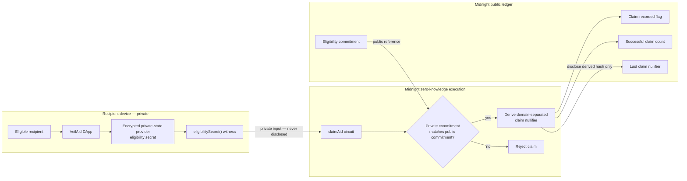

# VeilAid

> Prove you qualify. Claim once. Stay private.

VeilAid is a privacy-first aid distribution protocol built on Midnight Network.
It lets a recipient prove possession of an eligibility secret without publishing
that secret. The Level 1 prototype deploys one private eligibility commitment,
accepts one zero-knowledge claim, publishes only a domain-separated claim
marker, and rejects a second claim.

## What This Does

Aid programs often force recipients to expose names, identity documents, health
conditions, or financial hardship to several intermediaries. VeilAid gives an
organizer a public, auditable claim count while recipients prove eligibility
locally with private data.

## Initial Idea

VeilAid is a privacy-preserving platform for distributing aid, scholarships,
grants, vouchers, and community benefits. An organization publishes a
cryptographic commitment to approved eligibility. A recipient proves privately
that they hold the matching secret, receives a claim receipt, and cannot claim
twice. The Level 1 contract demonstrates this privacy boundary with one eligible
recipient. Later levels will replace the single commitment with an eligibility
Merkle root and campaign-scoped nullifier set so many recipients can claim
without revealing which approved record belongs to them.

## Level 1 behavior

The Compact contract:

1. Generates a high-entropy 32-byte eligibility secret in the DApp.
2. Keeps that secret in the encrypted Midnight private-state provider.
3. Publishes only a domain-separated commitment during deployment.
4. Reads the secret through the `eligibilitySecret()` witness when claiming.
5. Proves that the private secret matches the public commitment.
6. Uses `disclose()` only for the derived commitment and claim nullifier.
7. Records a public claim counter, one-time flag, and derived claim marker.
8. Rejects another claim after the one-time eligibility has been used.

## Architecture



The raw eligibility secret stays on the recipient's device. The proof reads it
through the private witness and checks it against the public commitment.
Successful execution reveals only a derived nullifier and updates auditable
public claim state.

## Privacy Model

- **Public:** eligibility commitment, successful claim count, one-time claim
  flag, and derived claim nullifier.
- **Private:** the recipient's 32-byte eligibility secret held by the encrypted
  private-state provider.
- **Proved without revealing:** the private secret hashes to the campaign's
  public eligibility commitment.

| Data | Location | Reason |
|---|---|---|
| Eligibility secret | Encrypted local private state | This is the recipient's private evidence and must never appear on-chain. |
| Eligibility commitment | Public ledger | Anyone can verify which commitment the campaign accepts without learning its preimage. |
| Successful claim count | Public ledger | Organizers and donors can audit distribution progress. |
| Claim recorded flag | Public ledger | The Level 1 campaign accepts its single eligibility only once. |
| Last claim nullifier | Public ledger | A domain-separated marker proves a claim was recorded without revealing the secret. |

The disclosure boundary is visible in
[`contracts/veil-aid.compact`](contracts/veil-aid.compact): the raw witness is
never disclosed, returned, logged, or placed in ledger state. The circuit
discloses only outputs of domain-separated persistent hashes.

## Tech Stack

- Midnight Preview network
- Compact language and compiler 0.31.1
- Midnight.js 4.1.1 and Compact Runtime 0.16.0
- Node.js 22 or newer
- Docker, Compose, and proof server 8.1.0

## Prerequisites

- Node.js 22 or newer
- Docker with Compose v2 and a running Docker engine
- Compact devtools with compiler 0.31.1
- Git and npm

Verify the local tools:

```bash
node --version
docker --version
docker compose version
compact --version
compact compile --version
```

Install Compact using Midnight's
[official installation guide](https://docs.midnight.network/getting-started/installation).

## Setup

```bash
git clone git@Yilkash:Yilkash/veil-aid.git
cd veil-aid
npm install
npm dedupe
```

## Run Tests

```bash
npm test
npm run build
```

`npm test` compiles the Compact source into `contracts/managed/veil-aid/`
and runs the privacy-primitive test suite. The generated directory contains the
contract TypeScript/JavaScript bindings, ZKIR, and prover/verifier keys.

The `overrides` entry in `package.json` pins
`@midnight-ntwrk/onchain-runtime-v3` to the version required by Midnight.js
4.1.1. Keep `npm dedupe` in setup so Compact Runtime and Midnight.js share one
`StateValue` class instance.

## Run on the bundled local devnet

```bash
npm run setup
npm run cli
```

`npm run setup` starts the node, indexer, and proof server, compiles the
contract, deploys it, and writes the local address to the gitignored
`.midnight-state.json`. In the CLI:

- choose **1** to submit the private eligibility proof;
- choose **2** to read the public claim state;
- choose **1** again to verify that the duplicate claim is rejected.

Run the deployed-contract smoke test:

```bash
npm run test:e2e
```

Reset generated state when needed:

```bash
npm run clean
docker compose down -v
```

## Deploy to Preview

Start the proof server and create a Preview wallet:

```bash
npm run proof-server:start
npm run setup -- --network preview
```

On the first Preview run, the script prints a wallet address and faucet URL,
then waits for test NIGHT. Fund that address through the faucet. The setup
continues automatically, deploys the contract, prints the public contract
address, and stores it in the gitignored state file.

Never commit `.midnight-state.json`, `.midnight-wallet-state/`, or
`midnight-level-db/`. They contain wallet or private application state.

## Verified local result

- Compact compile: passed
- Unit tests: 4 passed
- TypeScript build: passed
- Local node, indexer, and proof server: healthy
- Local deployment:
  `6dfeaa2c43773464d1f0caffa6018e2cabf782a6841ca0081e40efa2bf2da34e`
- First private claim: succeeded at block 196
- Public successful claim count: 1
- Duplicate claim: rejected by
  `This campaign eligibility has already claimed`
- End-to-end deployed-state check: passed

The local address is development evidence. The Rise In submission must use the
Preview or Preprod address produced by the public-network deployment.

## Contract Address

| Network | Contract address | Status |
|---|---|---|
| Preview | `f19931af3c381275ef72c4e6a28e50613b6f55139387d280744b38753376579d` | Deployed and verified by `npm run test:e2e` |
| Preprod | Not deployed | Preview satisfies the Level 1 public deployment requirement |

The Preview wallet synchronized with a faucet-funded balance, registered NIGHT
for DUST generation, deployed the contract, and passed the indexed state
read-back check on September 8, 2026.

## Screenshots

- [Compact compile output](docs/evidence/01-compact-compile.png)
- [Preview contract address and end-to-end verification](docs/evidence/02-preview-contract-address.png)

## Level 1 submission checklist

- [x] Node, Docker, Compact compiler, and proof-server setup
- [x] Compact contract with public ledger state and a private witness
- [x] Deliberate `disclose()` boundary
- [x] Contract compiles and generates circuit plus keys
- [x] Passing test suite
- [x] Local deployment and end-to-end state read
- [x] Product idea paragraph
- [x] Setup and architecture documentation
- [x] Deploy to Preview or Preprod
- [x] Add compile-output screenshot to `docs/evidence/`
- [x] Add public deployment-address screenshot to `docs/evidence/`
- [x] Publish the GitHub repository under Yilkash
- [x] Reach five meaningful commits

## Roadmap

The implementation plan for the full challenge is in
[`docs/VEILAID_BUILD_PLAYBOOK.md`](docs/VEILAID_BUILD_PLAYBOOK.md).
The next protocol milestone adds organizer authorization, an eligibility Merkle
root, campaign-scoped nullifiers for many recipients, and a web interface that
shows exactly what stays private before proof generation.

## Useful commands

| Command | Purpose |
|---|---|
| `npm run compile` | Compile Compact and generate managed ZK artifacts |
| `npm test` | Compile and run unit tests |
| `npm run build` | Type-check TypeScript |
| `npm run setup` | Start local devnet, compile, and deploy |
| `npm run cli` | Claim or inspect public campaign state |
| `npm run test:e2e` | Verify the deployed contract is indexed and readable |
| `npm run network preview` | Select Preview as the active network |
| `npm run clean` | Remove generated contract, wallet cache, and private state |

## License

MIT
